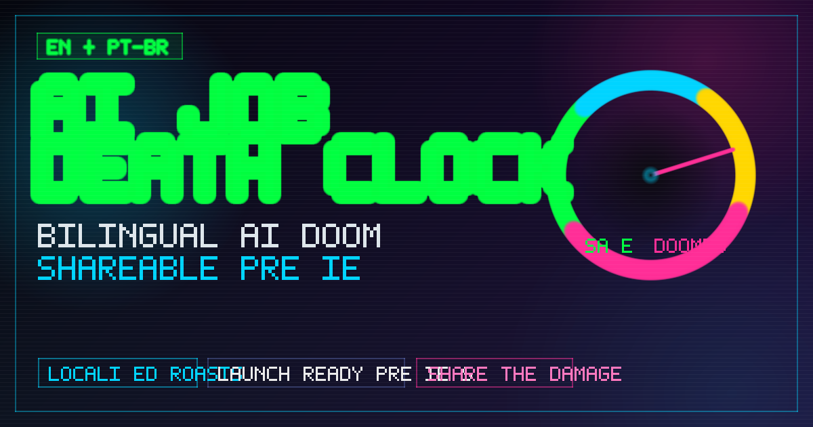

# AI Job Death Clock



**Find out when the machines come for your job.**

A cyberpunk-themed web app that calculates how many years, months, and days you have left before AI replaces you — then roasts you about it. Bilingual (English / Portuguese BR), shareable, and entirely client-side.

**[Try it live](https://giuice.github.io/risk-jobs/)**

---

## How It Works

Pick your profession, select your experience level, and hit **SEE YOUR FATE**. You get:

- A **countdown timer** (years, months, days until replacement)
- A **risk gauge** from SAFE to DOOMED
- A **personalized roast** that's mean but winking
- **Share buttons** to spread the doom (X, WhatsApp, LinkedIn, Facebook, Instagram)

---

## The Data

Occupation scores are based on **Andrej Karpathy's AI exposure analysis** of hundreds of US occupations, cross-referenced with BLS Occupational Outlook data. Each job gets a **Base AI Exposure Score** from 0 to 10:

- **10** = fully digital, easily automated
- **0** = requires physical presence, human judgment, or manual dexterity

| Score | Occupations |
|-------|-------------|
| 10 | Medical Transcriptionists |
| 9 | Software Developers, Data Scientists, Financial Analysts, Graphic Designers, Bank/Finance Clerks, General Office Clerks |
| 8.5 | Accountants and Auditors |
| 8 | Lawyers, Paralegals, IT Systems Analysts, IT Help Desk / Support |
| 7.5 | Financial Managers, Human Resources, Medical Records Clerks, Customer Service Reps, Secretaries, Travel Agents, Bookkeeping / Payroll |
| 7 | Cashiers, Air Traffic Controllers |
| 6 | Dietitians and Nutritionists |
| 5 | Airline Pilots, School Teachers |
| 4 | Bus Drivers, Registered Nurses, Other (Low Risk) |
| 3 | Dentists, Chefs, Police Officers |
| 2 | Electricians |

---

## The Algorithm

### Step 1 — Seniority Adjustment

Experience acts as a partial moat against automation. More senior professionals are harder to replace because they carry institutional knowledge, judgment, and relationships that AI can't easily replicate.

```
Adjusted Score = Base Score - (Seniority Level x 1.5)
```

Clamped to the range [0, 10].

| Experience | Seniority Level | Modifier |
|------------|----------------|----------|
| 0-2 years | Junior (0) | -0.0 |
| 3-5 years | Mid (1) | -1.5 |
| 6-9 years | Senior (2) | -3.0 |
| 10+ years | Architect (3) | -4.5 |

**Example:** A Junior Software Developer (base 9, level 0) has an adjusted score of **9.0**. A Senior Software Developer (base 9, level 2) drops to **6.0**.

### Step 2 — Shelf Life Calculation

The adjusted score maps to estimated years until replacement:

```
Shelf Life = (10 - Adjusted Score) x 1.2
```

Clamped to [0, 12] years.

| Adjusted Score | Shelf Life | Meaning |
|---------------|------------|---------|
| 10 | 0 years | Already replaceable |
| 7.5 | 3 years | Near-term risk |
| 5.0 | 6 years | Medium-term risk |
| 2.5 | 9 years | Long runway |
| 0 | 12 years | Maximum buffer |

### Step 3 — Risk Bands

The adjusted score also determines a qualitative risk category:

| Band | Range | Description |
|------|-------|-------------|
| LOW RISK | 0 - 2.5 | Machines only have you bookmarked |
| WATCHLIST | 2.5 - 4.5 | Replacement memo drafted, awaiting budget |
| EXPOSED | 4.5 - 6.5 | No longer future-proof |
| CRITICAL | 6.5 - 8.5 | Automation pilot has your chair in its rollout plan |
| DOOMED | 8.5 - 10 | AI is just asking where you keep the passwords |

---

## Disclaimer

This is a **heuristic model**, not a rigorous economic forecast. Scores are LLM-estimated against public labor data. The seniority modifier is a linear penalty reflecting human capital as a partial moat. No model predicts the future — this is a thinking tool (and a joke), not a prophecy.

---

## Tech Stack

- **Single HTML file** — no frameworks, no build step, no dependencies
- **Inline CSS/JS** — everything self-contained
- **GitHub Pages** — static hosting, zero cost
- **No API calls** — all data embedded, works offline
- **Bilingual** — English and Portuguese (BR) with runtime language toggle

---

## License

MIT
